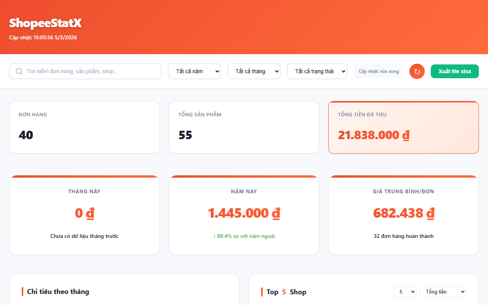
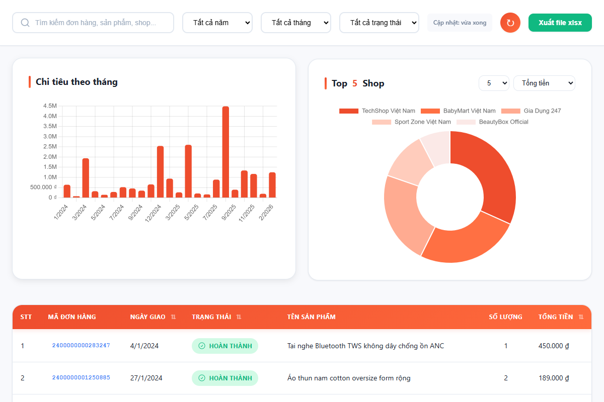
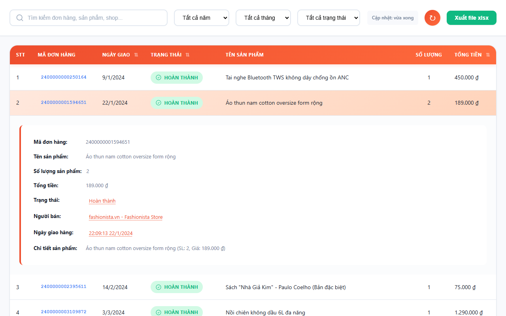
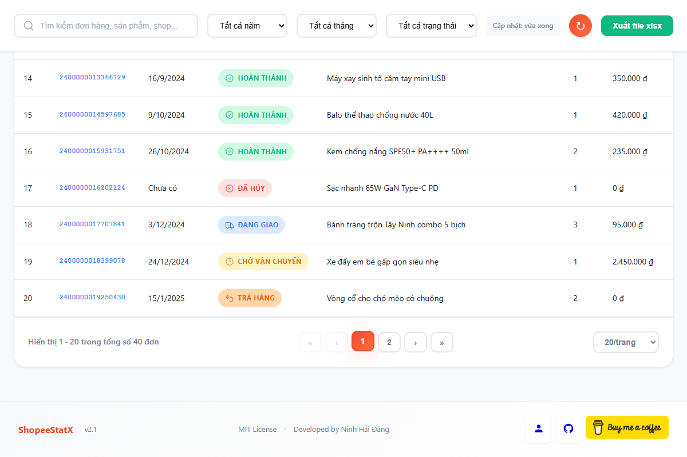
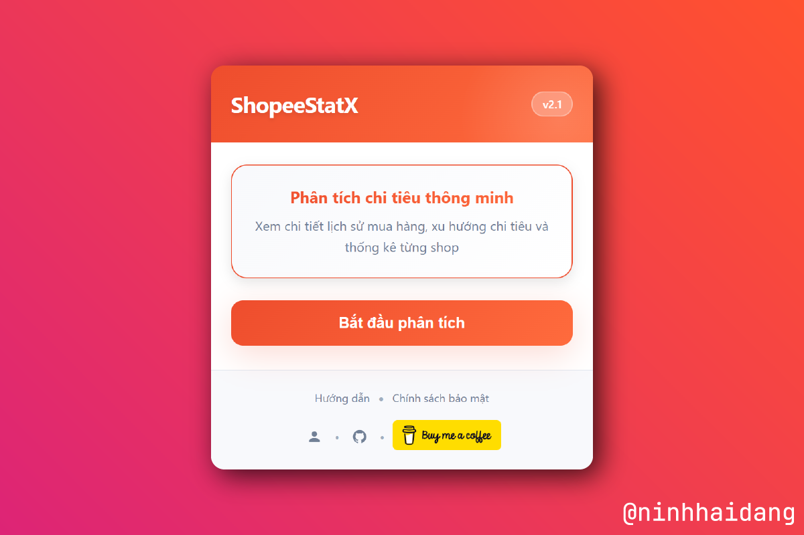

# ShopeeStatX - Thống Kê Chi Tiêu Shopee

<div align="center">


[](#)
[](Documents/README-en.md)

---

[](https://github.com/ninhhaidang/shopeestatx/stargazers)

</div>

> **Version 2.1** - Giao diện tối giản, biểu đồ thông minh

> Chrome Extension giúp theo dõi và phân tích chi tiêu trên Shopee một cách chi tiết và trực quan.

## 📸 Screenshots











## Giới thiệu
Shopee không cung cấp bất kỳ công cụ nào để người dùng biết mình đã tiêu bao nhiêu. ShopeeStatX giải quyết vấn đề đó — một extension Chrome tự động lấy toàn bộ lịch sử đơn hàng, phân tích và hiển thị trực quan bằng biểu đồ và bảng dữ liệu. Không cần server, không cần tài khoản riêng, dữ liệu không rời khỏi máy bạn.

## Tính năng chính
### 📊 Thống kê tổng quan
- Tổng số đơn, tổng chi tiêu (bao gồm giảm giá/voucher)
- Giá trung bình mỗi đơn hàng
- So sánh tháng này với tháng trước / năm nay với năm trước

### 🔍 Bộ lọc thông minh
- Tìm kiếm theo tên sản phẩm, shop, mã đơn hàng
- Lọc theo năm, tháng, trạng thái đơn hàng
- Filter chips hiển thị bộ lọc đang áp dụng, xóa từng cái hoặc xóa tất cả chỉ một click

### 📈 Biểu đồ tương tác
- Biểu đồ cột theo tháng hoặc ngày, biểu đồ tròn top shop
- Click cột tháng để xem chi tiết từng ngày, click ngày để lọc bảng dữ liệu
- Chọn metric hiển thị: tổng tiền / số đơn / số sản phẩm

### 📋 Bảng dữ liệu chi tiết
- Hiển thị đầy đủ STT, mã đơn, ngày giao, trạng thái (7 loại badge màu), sản phẩm, tổng tiền
- Sắp xếp theo bất kỳ cột nào, mở rộng xem chi tiết sản phẩm, click giá trị để tự động lọc
- Phân trang 20 / 50 / 100 / tất cả

### 📥 Xuất dữ liệu
- Xuất file Excel (.xlsx) với đúng dữ liệu đang lọc, headers tiếng Việt

### ⌨️ Phím tắt
- `/` mở tìm kiếm
- `Escape` xóa tìm kiếm
- `R` làm mới dữ liệu

## Cách hoạt động
### Mô hình xác thực
ShopeeStatX sử dụng phiên đăng nhập sẵn có của trình duyệt để truy cập dữ liệu Shopee. Người dùng chỉ cần đăng nhập Shopee như bình thường — extension tự động sử dụng session đó để gọi API. Không cần tạo tài khoản riêng, không lưu mật khẩu, không gửi dữ liệu ra ngoài.

Đây là mô hình xác thực chuẩn công nghiệp cho các extension chạy trên website cụ thể (tương tự Grammarly, Honey, Return YouTube Dislike).

- Kiểm tra domain: Chỉ hoạt động khi đang ở shopee.vn (`ShopeeStatX/popup.js:10-13`)
- Chưa đăng nhập: Hiển thị cảnh báo, vô hiệu hóa nút bắt đầu (`ShopeeStatX/popup.html:30-32`, `ShopeeStatX/popup.js:12`)
- Đã đăng nhập: Gọi API bằng session trình duyệt qua MAIN world injection (`ShopeeStatX/content.js`, `ShopeeStatX/manifest.json:16-18`)

### Luồng dữ liệu
```
Đăng nhập Shopee → Click icon extension → Popup kiểm tra domain
  → "Bắt đầu phân tích" → Mở trang kết quả
    → Loading spinner + cập nhật real-time số đơn đang lấy
      → Inject content.js (MAIN world) + bridge.js (ISOLATED world)
        → Fetch API Shopee (dùng session trình duyệt, có cookie)
        → postMessage → bridge → chrome.runtime → results.js
          → Cache vào chrome.storage.local
          → Render: Summary cards + Charts + Table
            → Tương tác: Filter / Sort / Search / Drill-down / Export
```

### Kiến trúc Dual-World
Chrome Extension mặc định chạy trong ISOLATED world — không thể truy cập cookie của trang web. ShopeeStatX giải quyết bằng Dual-World Pattern:

- content.js chạy trong MAIN world → truy cập fetch() và cookie như trang web bình thường
- bridge.js chạy trong ISOLATED world → relay message về extension
- Kết quả: Bypass CORS hợp lệ, không cần proxy server, không cần API key riêng

```
┌─────────────┐    ┌──────────────┐    ┌─────────────┐
│  popup.js   │───▶│ results.html │───▶│ results.js  │
│ (Trigger)   │    │ (Dashboard)  │    │ (Logic)     │
└─────────────┘    └──────┬───────┘    └──────┬──────┘
                          │                    │
                   inject │              listen│
                          ▼                    │
              ┌───────────────────┐            │
              │   Shopee.vn Tab   │            │
              │                   │            │
              │ ┌───────────────┐ │  message   │
              │ │  content.js   │─┼────────────┘
              │ │  (MAIN world) │ │  via bridge.js
              │ │  fetch API    │ │  (ISOLATED world)
              │ └───────────────┘ │
              └───────────────────┘
```

## Trải nghiệm người dùng
### Trạng thái & phản hồi
Extension luôn cho người dùng biết chuyện gì đang xảy ra:

- **Đang tải**: Loading spinner + cập nhật real-time số đơn hàng đang lấy
- **Không có kết quả**: Minh họa + thông báo "Không tìm thấy đơn hàng nào" + nút reset bộ lọc
- **Lỗi kết nối**: Thông báo lỗi cụ thể kèm nút mở lại Shopee
- **Chưa đăng nhập**: Cảnh báo rõ ràng, nút bắt đầu bị vô hiệu hóa
- **Bộ lọc đang áp dụng**: Filter chips animated hiển thị đang lọc gì, click để xóa từng chip
- **Sắp xếp**: Mũi tên ↑↓ chỉ hướng sắp xếp trên tiêu đề cột
- **Tooltips**: Hover lên summary cards để xem giải thích chi tiết
- **Cache**: Hiển thị "Cập nhật: X phút trước" khi đang dùng dữ liệu đã cache

### Design System
- 50+ CSS variables quản lý toàn bộ màu sắc, shadow, spacing, border-radius (`ShopeeStatX/results.css:9-58`)
- Bảng màu nhất quán theo Shopee orange `#ee4d2d` xuyên suốt
- 9+ keyframe animations: spin, pulse, slideIn, slideDown, chipIn, fadeIn, bounce, tooltipFade, expandRow
- Custom scrollbar styling (`ShopeeStatX/results.css:1446-1463`)

### Responsive
- 3 breakpoints: mobile (768px), tablet (1024px), desktop (`ShopeeStatX/results.css:1359-1444`)
- Mobile: Ẩn cột không cần thiết, stack layout, full-width controls
- System font stack để hiển thị nhất quán trên mọi thiết bị

### Tùy chỉnh hiển thị
Người dùng điều chỉnh trải nghiệm ngay trên giao diện:
- Số item mỗi trang: 20 / 50 / 100 / Tất cả
- Metric biểu đồ: Tổng tiền / Số đơn / số sản phẩm
- Số shop trong biểu đồ tròn: 3 / 5 / 10 / 15
- Lọc theo năm, tháng, trạng thái đơn hàng

Dữ liệu không rời khỏi máy người dùng — không cần tạo tài khoản, không cần server, không thu thập dữ liệu cá nhân.

## ⚙️ Cài đặt
1. Tải mã nguồn:
   - **Tải file ZIP**: Tải từ [Releases](https://github.com/ninhhaidang/shopeestatx/releases) và giải nén
   - **Hoặc Clone repository**:
   ```bash
   git clone https://github.com/ninhhaidang/shopeestatx.git
   ```

2. Mở Chrome, vào `chrome://extensions/`

3. Bật "Chế độ nhà phát triển"

4. Click "Tải chưa giải nén" và chọn thư mục `ShopeeStatX`

## 📖 Hướng dẫn sử dụng
Xem hướng dẫn chi tiết tại [Hướng dẫn](/Documents/Huong_dan.md)

**Tóm tắt:**
1. Đăng nhập tài khoản [Shopee](https://shopee.vn)
2. Bật tiện ích ShopeeStatX trên thanh công cụ Chrome
3. Click "Bắt đầu phân tích"
4. Sử dụng bộ lọc và biểu đồ để phân tích chi tiêu

## 🛠️ Công nghệ sử dụng
| Công nghệ | Vai trò | Lý do lựa chọn |
|-----------|---------|----------------|
| Chrome Extension MV3 | Runtime | Standard mới nhất, Service Worker model |
| Vanilla JavaScript | Logic | Zero dependency, không cần build, dễ maintain |
| Chart.js (vendored) | Visualization | Thư viện chart phổ biến, nhẹ, responsive |
| SheetJS (vendored) | Export | Tạo file Excel chuẩn (.xlsx) |
| chrome.storage.local | Cache | Lưu dữ liệu offline, không cần server |
| Shopee API v4 | Data source | `v4/order/get_all_order_and_checkout_list` |

## 📁 Cấu trúc dự án
```
ShopeeStatX/
├── manifest.json       # Cấu hình extension (Manifest V3)
├── background.js       # Service worker
├── popup.html/js/css   # Popup khi click icon extension
├── results.html/js/css # Dashboard phân tích (~1000 dòng logic)
├── content.js          # MAIN world — gọi Shopee API với cookie
├── bridge.js           # ISOLATED world — relay message về extension
├── chart.min.js        # Chart.js (vendored, không dùng CDN)
└── xlsx.min.js         # SheetJS (vendored, không dùng CDN)
```

## ⚠️ Lưu ý
- Extension chỉ hoạt động khi đã đăng nhập Shopee
- Dữ liệu lấy trực tiếp từ API Shopee, không qua server trung gian
- Ngày giao hàng: Thời điểm giao/nhận hàng thành công
- Đơn đã hủy và trả hàng: Không tính vào tổng chi tiêu
- Dữ liệu chỉ tồn tại trong session cục bộ, không gửi đi đâu
- Extension này không liên quan đến Shopee chính thức

## License

[MIT License](LICENSE)

## 👨‍💻 Tác giả

<div align="center">

**Phát triển bởi [Ninh Hải Đăng](https://github.com/ninhhaidang)**

[](https://ninhhaidang.dev)
[](https://github.com/ninhhaidang)
[](https://www.buymeacoffee.com/ninhhaidang)

</div>
